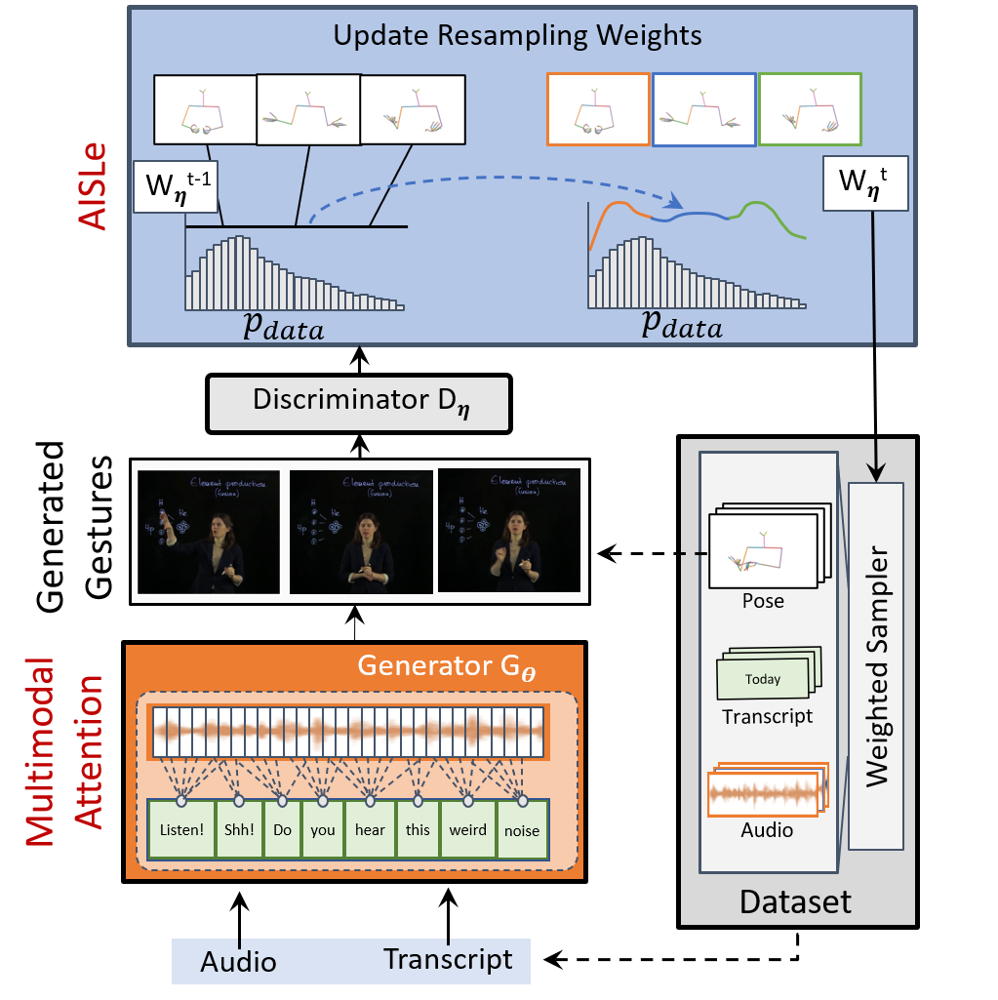

# AISLe

This is the official repository for the paper *No Gestures Left Behind: Learning Relationships between Spoken Language and Freeform Gestures* 

[Chaitanya Ahuja](http://chahuja.com), Dong Won Lee, Ryo Ishii, [Louis-Philippe Morency](https://www.cs.cmu.edu/~morency/) - [EMNLP Findings 2020](https://2020.emnlp.org/)

[](https://opensource.org/licenses/MIT)

Links: [Paper](https://www.aclweb.org/anthology/2020.findings-emnlp.170.pdf), [Dataset Website [1]](http://chahuja.com/pats)

Bibtex:

```sh
@inproceedings{ahuja2020no,
  title={No Gestures Left Behind: Learning Relationships between Spoken Language and Freeform Gestures},
  author={Ahuja, Chaitanya and Lee, Dong Won and Ishii, Ryo and Morency, Louis-Philippe},
  booktitle={Proceedings of the 2020 Conference on Empirical Methods in Natural Language Processing: Findings},
  pages={1884--1895},
  year={2020}
}
```

# Overview



This repo has information on the training code and pre-trained models. 

For the dataset, we refer you to:
* [Dataset Website](http://chahuja.com/pats) for downloading the dataset
* [Dataset Repo](https://github.com/chahuja/pats) for scripts to download the audio files and other dataloader arguments. 

For the purposes of this repository, we assume that the dataset is downloaded to `../data/`

This repo is divided into the following sections:

* [Clone](#clone)
* [Set up environment](#set-up-environment)
* [Training](#training)
* [Inference](#inference)
* [Rendering](#rendering)

This is followed by additional informational sections:
* [Experiment Files](#experiment-files)

## Clone
Clone only the master branch,

```sh
git clone -b master --single-branch https://github.com/chahuja/mix-stage.git
```

## Set up Environment
* pycasper

```sh
mkdir ../pycasper
git clone https://github.com/chahuja/pycasper ../pycasper
ln -s ../pycasper/pycasper .
```

* Create an [anaconda](https://www.anaconda.com/) or a virtual enviroment and activate it

```sh
pip install -r requirements.txt
```

## Training
To train a model from scratch, run the following script after chaging directory to [src](src/),

```sh
python train.py \
 -weighted 400 \ ## argument to run AISLe for adaptive reweighting; to be used with `gan=1`; the number refers to the number of iterations per epoch
 -cpk JointLateClusterSoftTransformer12_G \ ## checkpoint name which is a part of experiment file PREFIX
 -exp 1 \ ## creates a unique experiment number
 -path2data ../data ## path to data files
 -speaker '["oliver"]' \ ## Speaker
 -model JointLateClusterSoftTransformer12_G \ ## Name of the model
 -modelKwargs '{"lambda_id": 0.1, "argmax": 1, "some_grad_flag": 1, "train_only": 1}' \ ## List of extra arguments to instantiate an object of the model
 -note aisle \ ## unique identifier for the model to group results
 -save_dir save/aisle \ ## save directory
 -modalities '["pose/normalize", "text/tokens", "audio/log_mel_400"]' \ ## all modalities as a list. output modality first, then input modalities
 -repeat_text 0 \ ## tokens are not repeated to match the audio frame rate
 -fs_new '[15, 15]' \ ## frame rate of each modality
 -input_modalities '["text/tokens", "audio/log_mel_400"]' \ ## List of input modalities
 -output_modalities '["pose/normalize"]' \ ## List of output modalities
 -gan 1 \ ## Flag to train with a discriminator on the output
 -loss L1Loss \ ## Choice of loss function. Any loss function torch.nn.* will work here
 -window_hop 5 \ ## Hop size of the window for the dataloader
 -render 0 \ ## flag to render. Default 0
 -batch_size 32 \ ## batch size
 -num_epochs 100 \ ## total number of epochs
 -min_epochs 50 \ ## early stopping can occur after these many epochs occur
 -overfit 0 \ ## flag to overfit (for debugging)
 -early_stopping 0 \ ## flag to perform early stopping 
 -dev_key dev_spatialNorm \ ## metric used to choose the best model
 -num_clusters 8 \ ## number of clusters in the Conditional Mix-GAN
 -feats '["pose", "velocity", "speed"]' \ ## Festures used to make the clusters
 -optim AdamW \ ## AdamW optimizer
 -lr 0.0001 \ ## Learning Rate
 -optim_separate 0.00003 \ ## Use a separate recommended optimizer and learning rate schedule for the language encoder BERT
```

Scripts for training models in the paper can be found as follows, *[Coming soon]*

- [Ours]()
- [Ours w/o G_attn]()
- [Ours w/o AISLe]()
- [Gesticulator [2]]() 
- [Speech2Gesture [3]]()

## Inference
### Inference for quantitative evaluation

```sh
python sample.py \
-load <path2weights> \ ## path to PREFIX_weights.p file
-path2data ../data ## path to data
```

### Pre-trained models
Coming soon

## Rendering

```sh
python render.py \
-render 20 \ ## number of intervals to render
-load <path2weights> \ ## path to PREFIX_weights.p file
-render_text 1 ## if 1, render text on the video as well.
-path2data ../data ## path to data
```

## Experiment Files
Every experiment multiple files with the same PREFIX:

### Training files
* PREFIX_args.args - arguments stored as a dictionary
* PREFIX_res.json - results for every epoch
* PREFIX_weights.p - weights of the best model
* PREFIX_log.log - log file 
* PREFIX_name.name - name file to restore value of PREFIX

## Inference files
* PREFIX/ - directory containing sampled h5 files and eventually renders
* PREFIX_cummMetrics.json - metrics estimated at inference which are reported in the paper

## References
```sh
[1] - Ahuja, Chaitanya et al. "Style Transfer for Co-Speech Gesture Animation: A Multi-Speaker Conditional Mixture Approach" ECCV 2020.
[2] - Kucherenko, Taras, et al. "Gesticulator: A framework for semantically-aware speech-driven gesture generation." ICMI 2020.
[3] - Ginosar, Shiry, et al. "Learning individual styles of conversational gesture." CVPR 2019.
```

## Other cool stuff
If you enjoyed this work, I would recommend the following projects which study different axes of nonverbal grounding,
- [Mix-StAGe](http://chahuja.com/mix-stage)
- [Language2Pose](http://chahuja.com/language2pose)
- [Dialogue2Pose](https://arxiv.org/pdf/1910.02181.pdf)

# Issues
All research has a tag of work in progress. If you find any issues with this code, feel free to raise issues or pull requests (even better) and I will get to it as soon as humanly possible.
